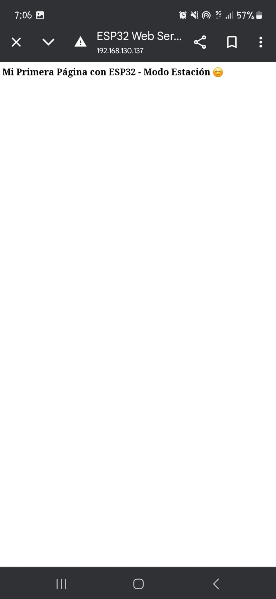
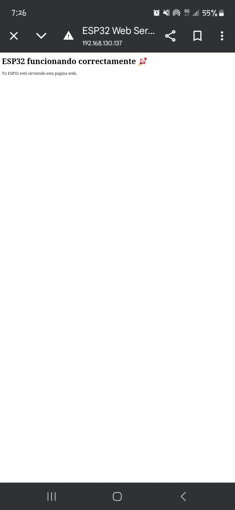

*Sandra Cots P3*

**Informe de la Práctica 3: WiFi y Bluetooth**

**Introducción**

El objetivo de esta práctica es comprender el funcionamiento de las comunicaciones **WiFi** y **Bluetooth** en el microcontrolador **ESP32**. Se han realizado tres prácticas:

1. **Práctica A**: Generación de una página web utilizando el ESP32 como servidor web en modo estación (STA).
1. **Práctica B**: Comunicación serie a través de Bluetooth clásico entre el ESP32 y un dispositivo móvil.
1. **Modificación de la página web**: Creación de un fichero HTML adicional para personalizar la página web servida por el ESP32.
-----
**Práctica A: Generación de una Página Web**

**Descripción**

Se configura el ESP32 como un **servidor web en modo estación (STA)**. El servidor web muestra una página HTML simple accesible desde cualquier navegador en la misma red WiFi.

**Código**

#include <WiFi.h>

#include <WebServer.h>

// Definición de credenciales WiFi

const char\* ssid = "SS"; // Reemplaza con tu SSID

const char\* password = "12345678"; // Reemplaza con tu contraseña

WebServer server(80); // Servidor en el puerto 80

// Función para manejar la raíz

void handle\_root() {

`    `String html = "<!DOCTYPE html>\

`    `<html>\

`    `<head>\

`        `<meta charset='UTF-8'>\

`        `<title>ESP32 Web Server</title>\

`    `</head>\

`    `<body>\

`        `<h1>Mi Primera Página con ESP32 - Modo Estación 😊</h1>\

`    `</body>\

`    `</html>";

`    `server.send(200, "text/html", html);

}

void setup() {

`    `Serial.begin(115200);

`    `Serial.println("\nConectando a WiFi...");

`    `WiFi.begin(ssid, password);

`    `while (WiFi.status() != WL\_CONNECTED) {

`        `delay(1000);

`        `Serial.print(".");

`    `}

`    `Serial.println("\nWiFi conectado exitosamente!");

`    `Serial.print("Dirección IP: ");

`    `Serial.println(WiFi.localIP()); // Mostrar IP asignada

`    `server.on("/", handle\_root);

`    `server.begin();

`    `Serial.println("Servidor HTTP iniciado.");

}

void loop() {

`    `server.handleClient();

}

**Salida Esperada**

- En el monitor serie, se muestra la conexión WiFi y la **dirección IP** asignada al ESP32.
- Al acceder a la dirección IP desde un navegador, se muestra la página web con el mensaje: **"Mi Primera Página con ESP32 - Modo Estación 😊"**.

\## **IMAGEN 1**

-----
**Práctica B: Comunicación Bluetooth con el Móvil**

**Descripción**

Se configura el ESP32 para **comunicarse con un dispositivo móvil** mediante **Bluetooth clásico**.

**Código**

#include "BluetoothSerial.h"

#if !defined(CONFIG\_BT\_ENABLED) || !defined(CONFIG\_BLUEDROID\_ENABLED)

#error Bluetooth is not enabled! Please run `make menuconfig` to enable it.

#endif

BluetoothSerial SerialBT;

void setup() {

`    `Serial.begin(115200);

`    `SerialBT.begin("ESP32test"); 

`    `Serial.println("The device started, now you can pair it with Bluetooth!");

}

void loop() {

`    `if (Serial.available()) {

`        `SerialBT.write(Serial.read());

`    `}

`    `if (SerialBT.available()) {

`        `Serial.write(SerialBT.read());

`    `}

`    `delay(20);

}

**Salida Esperada**

- En el **monitor serie**, se muestra el mensaje: **"The device started, now you can pair it with Bluetooth!"**.
- Al emparejar el ESP32 con un dispositivo móvil y usar una **app de terminal Bluetooth**, se pueden **enviar y recibir datos**.
-----
**Modificación de la Página Web**

**Descripción**

Se personaliza la página web servida por el ESP32 utilizando un archivo HTML.

**Código**

#include <WiFi.h>

#include <WebServer.h>

// Credenciales WiFi

const char\* ssid = "SS"; 

const char\* password = "12345678"; 

WebServer server(80);

// Página HTML personalizada

void handle\_root() {

`    `String html = "<!DOCTYPE html>\

`    `<html>\

`    `<head>\

`        `<meta charset='UTF-8'>\

`        `<title>ESP32 Web Server</title>\

`    `</head>\

`    `<body>\

`        `<h1>ESP32 funcionando correctamente 🚀</h1>\

`        `
Tu ESP32 está sirviendo esta página web.
\

`    `</body>\

`    `</html>";

`    `server.send(200, "text/html", html);

}

void setup() {

`    `Serial.begin(115200);

`    `WiFi.begin(ssid, password);

`    `while (WiFi.status() != WL\_CONNECTED) {

`        `delay(1000);

`        `Serial.print(".");

`    `}

`    `Serial.println("\nWiFi conectado!");

`    `Serial.print("IP asignada: ");

`    `Serial.println(WiFi.localIP());

`    `server.on("/", handle\_root);

`    `server.begin();

`    `Serial.println("Servidor web iniciado.");

}

void loop() {

`    `server.handleClient();

}

**Salida Esperada**

- Al acceder a la **dirección IP**, se muestra una página con el mensaje: 
  - **"ESP32 funcionando correctamente 🚀"**
  - **"Tu ESP32 está sirviendo esta página web."**

\## **IMAGEN 2**

` `

-----
**Conclusiones**

- **WiFi**: El ESP32 puede actuar como **servidor web**, permitiendo la creación de páginas accesibles desde cualquier dispositivo en la misma red.
- **Bluetooth**: Puede comunicarse con dispositivos móviles mediante **Bluetooth clásico**, facilitando la transmisión de datos.
- **Personalización Web**: Se puede **modificar y mejorar** la página servida con HTML y CSS.

-----
**Ejercicios de Mejora de Nota**

1. **Modo AP**: Configurar el ESP32 en modo **Access Point (AP)** en lugar de **STA**.

**Descripción**

En este ejercicio, el ESP32 se configura en modo **Access Point (AP)**, creando su propia red WiFi a la que otros dispositivos pueden conectarse.

**Código**

#include <WiFi.h>

#include <WebServer.h>

const char\* ssid = "ESP32\_AP";

const char\* password = "12345678";

WebServer server(80);

void handle\_root() {

`    `server.send(200, "text/html", "<h1>Bienvenido al ESP32 en Modo AP</h1>");

}

void setup() {

`    `Serial.begin(115200);

`    `WiFi.softAP(ssid, password);

`    `Serial.println("Punto de acceso iniciado");

`    `Serial.print("Dirección IP del AP: ");

`    `Serial.println(WiFi.softAPIP());

`    `server.on("/", handle\_root);

`    `server.begin();

}

void loop() {

`    `server.handleClient();

}

**Salida Esperada**

- El ESP32 crea una red WiFi llamada **ESP32\_AP**.
- Al conectarse a la red y acceder a 192.168.4.1, se muestra un mensaje en la página web: **"Bienvenido al ESP32 en Modo AP"**.
-----

1. **BLE (Bluetooth Low Energy)**: Implementar **Bluetooth Low Energy (BLE)** en lugar de Bluetooth clásico.

**Descripción**

En este ejercicio, se implementa la comunicación **Bluetooth Low Energy (BLE)** en el ESP32, permitiendo la comunicación con aplicaciones móviles compatibles.

**Código**

#include <BLEDevice.h>

#include <BLEUtils.h>

#include <BLEServer.h>

#define SERVICE\_UUID "12345678-1234-5678-1234-56789abcdef0"

#define CHARACTERISTIC\_UUID "abcd1234-5678-1234-5678-abcdef123456"

BLEServer\* pServer = NULL;

BLECharacteristic\* pCharacteristic = NULL;

bool deviceConnected = false;

class MyServerCallbacks: public BLEServerCallbacks {

`    `void onConnect(BLEServer\* pServer) {

`        `deviceConnected = true;

`    `};

`    `void onDisconnect(BLEServer\* pServer) {

`        `deviceConnected = false;

`    `}

};

void setup() {

`    `Serial.begin(115200);

`    `BLEDevice::init("ESP32\_BLE");

`    `pServer = BLEDevice::createServer();

`    `pServer->setCallbacks(new MyServerCallbacks());

`    `BLEService\* pService = pServer->createService(SERVICE\_UUID);

`    `pCharacteristic = pService->createCharacteristic(

`                      `CHARACTERISTIC\_UUID,

`                      `BLECharacteristic::PROPERTY\_READ | BLECharacteristic::PROPERTY\_WRITE);

`    `pCharacteristic->setValue("Hola desde ESP32");

`    `pService->start();

`    `BLEAdvertising\* pAdvertising = BLEDevice::getAdvertising();

`    `pAdvertising->addServiceUUID(SERVICE\_UUID);

`    `BLEDevice::startAdvertising();

`    `Serial.println("Servidor BLE iniciado");

}

void loop() {

`    `if (deviceConnected) {

`        `pCharacteristic->setValue("Mensaje actualizado");

`        `pCharacteristic->notify();

`        `delay(1000);

`    `}

}

**Salida Esperada**

- El ESP32 se anuncia como **ESP32\_BLE**.
- Puede ser detectado y conectado por una aplicación BLE en un móvil.
- Permite enviar y recibir datos a través del servicio BLE.
-----
**Conclusiones**

- **Modo AP**: El ESP32 puede actuar como un **punto de acceso WiFi**, permitiendo la conexión de dispositivos sin necesidad de un router externo.
- **BLE**: Bluetooth Low Energy permite la comunicación eficiente con dispositivos móviles utilizando servicios y características definidas.
-----

